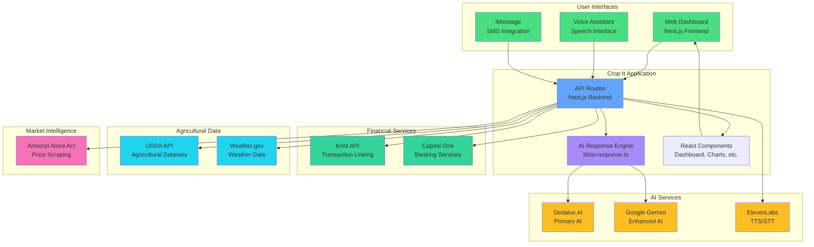

# 🌾 Crop It - AI-Powered Agricultural Intelligence Platform

**Crop It** is a comprehensive, AI-driven agricultural management platform that empowers farmers with intelligent insights for crop management, financial tracking, soil health analysis, and real-time decision-making. Built for modern farmers who need data-driven solutions to optimize their operations.

## 🎯 Overview

Crop It combines cutting-edge AI technology with real-world agricultural data to provide farmers with:
- **Predictive Analytics** for crop yields and planting decisions
- **Financial Intelligence** through transaction analysis and spending insights
- **Soil Health Monitoring** with regenerative agriculture recommendations
- **Voice-Powered Interface** for hands-free farm management
- **Real-Time Weather** integration for informed decision-making
- **Marketplace Analysis** for competitive pricing intelligence

## ✨ Key Features

### 🤖 AI-Powered Intelligence
- **Multi-AI Architecture**: Integrates Dedalus AI and Google Gemini for intelligent responses
- **Context-Aware Chatbot**: Understands farm-specific queries and provides actionable insights
- **Voice Assistant**: Natural language interaction with text-to-speech and speech-to-text
- **Smart Recommendations**: AI analyzes patterns to suggest cost-effective farming strategies

### 💰 Financial Management
- **Transaction Linking**: Secure bank account integration via Knot API
- **Spending Analytics**: AI-powered analysis of farm expenditures
- **Capital One Integration**: Access to banking services and loan information
- **Cost Optimization**: Intelligent recommendations for reducing operational costs

### 🌱 Agricultural Intelligence
- **Crop Yield Predictions**: Advanced forecasting with historical comparisons
- **Soil Health Dashboard**: Comprehensive metrics including:
  - Carbon sequestration tracking
  - Biodiversity metrics
  - Nutrient density analysis
  - Regenerative agriculture recommendations
- **Planting & Harvesting Calendar**: Optimal timing windows based on data analysis
- **USDA Data Integration**: Access to official agricultural datasets

### 🌤️ Real-Time Data
- **Weather Integration**: Current conditions and 4-day forecasts via Weather.gov
- **Marketplace Analysis**: Price scraping and competitive intelligence via Amazon Nova Act

### 🎨 User Experience
- **Modern Dashboard**: Clean, intuitive interface with real-time visualizations
- **Multi-Channel Access**: Web interface, voice assistant, and iMessage integration
- **Responsive Design**: Works seamlessly on desktop and mobile devices
- **Accessibility**: Voice-first design for hands-free operation

## 🚀 Tech Stack

### Frontend Framework
- **Next.js 14** - React framework with App Router for server-side rendering
- **React 18** - Modern React with concurrent features
- **TypeScript** - Type-safe development
- **Tailwind CSS** - Utility-first CSS framework

### Data Visualization
- **Recharts** - Responsive chart library for analytics
- **Lucide React** - Modern icon library

### Utilities
- **date-fns** - Date manipulation and formatting
- **knotapi-js** - Knot Transaction Link SDK

## 🏗️ System Architecture



### Data Flow

1. **User Input** → Web/Voice/iMessage interfaces
2. **API Routes** → Process requests and route to appropriate services
3. **AI Engine** → Generates intelligent responses using Dedalus/Gemini
4. **External APIs** → Fetch real-time data (weather, USDA, financial)
5. **Components** → Render data visualizations and insights
6. **User Dashboard** → Display comprehensive farm intelligence

## 🔌 APIs & Integrations

### AI Services
| Service | Purpose |
|---------|---------|
| **Dedalus AI** | Primary AI for intelligent responses |
| **Google Gemini** | Enhanced AI capabilities and insights |
| **ElevenLabs** | Natural voice synthesis (TTS/STT) |

### Financial Services
| Service | Purpose |
|---------|---------|
| **Knot API** | Transaction linking and bank account integration |
| **Capital One Nessie API** | Banking services and loan information |

### Agricultural Data
| Service | Purpose |
|---------|---------|
| **USDA API** | Official agricultural datasets |
| **Weather.gov API** | Real-time weather data and forecasts |

### Market Intelligence
| Service | Purpose |
|---------|---------|
| **Amazon Nova Act** | Price scraping and market analysis |

### Communication
| Service | Purpose |
|---------|---------|
| **iMessage Integration** | SMS/chat interface for farm queries |

## 📁 Project Structure

```
crop-it/
├── app/
│   ├── api/                      # API routes
│   │   ├── dedalus/              # Dedalus AI integration
│   │   ├── gemini/                # Google Gemini AI
│   │   ├── elevenlabs-tts/        # Text-to-speech
│   │   ├── elevenlabs-stt/       # Speech-to-text
│   │   ├── knot-session/         # Knot session management
│   │   ├── knot-transactions/    # Transaction data
│   │   ├── capital-one/           # Banking services
│   │   │   ├── accounts/         # Account management
│   │   │   ├── customers/       # Customer data
│   │   │   └── loans/           # Loan information
│   │   ├── usda-data/            # USDA agricultural data
│   │   ├── weather/               # Weather.gov integration
│   │   ├── amazon-nova/          # Price scraping
│   │   ├── marketplace-analysis/ # Market insights
│   │   ├── yield-prediction/    # Crop yield forecasts
│   │   ├── soil-health/         # Soil metrics
│   │   ├── planting-advice/     # Planting recommendations
│   │   ├── farm-data/           # Farm information
│   │   └── imessage/            # iMessage integration
│   ├── login/                     # Authentication
│   ├── transactions/              # Financial tracking page
│   ├── marketplace/               # Marketplace analysis
│   └── page.tsx                   # Main dashboard
├── components/
│   ├── Dashboard.tsx              # Main dashboard component
│   ├── VoiceAssistant.tsx         # Voice AI interface
│   ├── ChatBot.tsx                # AI chatbot
│   ├── SpendingTracker.tsx        # Financial analytics
│   ├── CropYieldPrediction.tsx     # Yield forecasting
│   ├── SoilHealth.tsx             # Soil health metrics
│   ├── WeatherWidget.tsx          # Weather display
│   ├── PlantingAdvice.tsx         # Planting calendar
│   ├── AdvancedSoilMetrics.tsx    # Detailed soil data
│   ├── CarbonSequestration.tsx    # Carbon tracking
│   ├── BiodiversityMetrics.tsx   # Biodiversity analysis
│   └── ...                        # Additional components
├── lib/
│   ├── ai-response.ts             # Core AI response generator
│   └── knot-config.ts            # Knot API configuration
├── types/
│   └── knot.d.ts                 # TypeScript definitions
└── public/                        # Static assets
```

## 🛠️ Installation & Setup

### Prerequisites
- **Node.js** 18+ 
- **npm** or **yarn**
- API keys for integrated services (see below)

### Step 1: Clone Repository
```bash
git clone https://github.com/swetha-ganeshbabu/crop.git
cd crop
```

### Step 2: Install Dependencies
```bash
npm install
```

### Step 3: Environment Variables
Create a `.env.local` file in the root directory:

```env
# AI Services
NEXT_PUBLIC_DEDALUS_API_KEY=your_dedalus_api_key
GEMINI_API_KEY=your_gemini_api_key
ELEVENLABS_API_KEY=your_elevenlabs_api_key

# Financial Services (Optional - Knot is pre-configured for hackathon)
KNOT_CLIENT_ID=your_knot_client_id
KNOT_CLIENT_SECRET=your_knot_client_secret
CAPITAL_ONE_API_KEY=your_capital_one_api_key

# Agricultural Data
USDA_API_KEY=your_usda_api_key

# Market Intelligence (Optional)
AMAZON_NOVA_API_KEY=your_nova_api_key

# Application
NEXT_PUBLIC_BASE_URL=http://localhost:3000
```

**Note**: Most services have intelligent fallbacks and will work without API keys using mock data for development.

### Step 4: Run Development Server
```bash
npm run dev
```

Open [http://localhost:3000](http://localhost:3000) in your browser.

## 🌐 Deployment

### Vercel (Recommended)

1. **Push to GitHub**
   ```bash
   git push origin main
   ```

2. **Connect to Vercel**
   - Go to [vercel.com](https://vercel.com)
   - Import your GitHub repository
   - Add environment variables in Vercel dashboard
   - Deploy automatically on every push

3. **Environment Variables**
   Add all API keys from `.env.local` to Vercel's environment variables section.

### Manual Deployment

```bash
npm run build
npm start
```

See [DEPLOYMENT.md](./DEPLOYMENT.md) for detailed deployment instructions.

## 📡 API Endpoints

### AI Services
- `POST /api/dedalus` - Dedalus AI chat completions
- `POST /api/gemini` - Google Gemini AI responses
- `POST /api/elevenlabs-tts` - Text-to-speech conversion
- `POST /api/elevenlabs-stt` - Speech-to-text conversion
- `POST /api/imessage` - iMessage webhook integration

### Financial Services
- `GET /api/knot-session` - Create Knot session for account linking
- `GET /api/knot-transactions` - Fetch linked transactions
- `GET /api/capital-one/customers` - Capital One customer data
- `GET /api/capital-one/accounts` - Account information
- `GET /api/capital-one/loans` - Loan details

### Agricultural Data
- `GET /api/farm-data` - Farm information and field data
- `GET /api/yield-prediction` - Crop yield forecasts
- `GET /api/soil-health` - Soil health metrics and recommendations
- `GET /api/planting-advice` - Planting and harvesting recommendations
- `GET /api/usda-data` - USDA agricultural datasets
- `GET /api/weather` - Weather data and forecasts

### Market Intelligence
- `POST /api/amazon-nova` - Price scraping and market analysis
- `POST /api/marketplace-analysis` - Competitive market insights

## 🎨 Key Features in Detail

### Voice Assistant
Interact with Crop It using natural language:
- Ask about soil health: *"How is my soil health?"*
- Get yield predictions: *"What's my expected crop yield?"*
- Check weather: *"What's the weather forecast?"*
- Analyze spending: *"Show me my spending patterns"*
- Get recommendations: *"What should I plant this season?"*

### Financial Tracking
- **Secure Account Linking**: Connect bank accounts via Knot API
- **Transaction Analysis**: AI-powered categorization and insights
- **Spending Patterns**: Identify trends and cost-saving opportunities
- **Loan Management**: Access Capital One loan information
- **Smart Recommendations**: Get suggestions for optimizing farm expenses

### Soil Health Dashboard
Comprehensive soil analysis including:
- **Carbon Sequestration**: Track carbon capture metrics
- **Biodiversity Metrics**: Monitor ecosystem health
- **Nutrient Density**: Analyze soil nutrient levels
- **Regenerative Practices**: Recommendations for sustainable farming
- **Historical Trends**: Track changes over time

### Crop Yield Predictions
- **Advanced Forecasting**: ML-based predictions with historical data
- **Historical Comparisons**: Compare with previous years
- **Weather Integration**: Factor in weather patterns
- **Optimal Timing**: Best planting and harvesting windows

## 🧪 Development

### Available Scripts

```bash
npm run dev      # Start development server
npm run build    # Build for production
npm run start    # Start production server
npm run lint     # Run ESLint
npm run check-all # Lint and build
```

### Code Quality
- **TypeScript** - Full type safety
- **ESLint** - Code quality enforcement
- **Pre-build Linting** - Automatic checks before deployment

### Architecture Highlights
- **Server-Side Rendering** - Fast initial page loads
- **API Routes** - Secure backend endpoints
- **Shared AI Logic** - Unified AI responses across all interfaces
- **Fallback Mechanisms** - Graceful degradation when APIs are unavailable
- **Type Safety** - Comprehensive TypeScript coverage

## 🔐 Security & Privacy

- **Environment Variables** - Sensitive keys stored securely
- **API Key Management** - Centralized configuration
- **Secure Transactions** - Knot API handles financial data securely
- **No Data Storage** - Transactions processed in real-time
- **HTTPS Only** - All API calls use secure connections

## 📊 Technologies & SDKs

### Core Technologies
- **Next.js 14** - React framework with App Router
- **React 18** - UI library
- **TypeScript 5.3** - Type-safe JavaScript
- **Tailwind CSS 3.3** - Utility-first CSS

### Libraries & Tools
- **Recharts 2.10** - Data visualization
- **Lucide React** - Icon system
- **date-fns 2.30** - Date utilities
- **knotapi-js 1.0** - Knot Transaction Link SDK

### External Services
- **Dedalus Labs** - AI chat completions
- **Google Gemini** - Generative AI
- **ElevenLabs** - Voice synthesis
- **Knot** - Financial transaction linking
- **Capital One** - Banking services
- **USDA** - Agricultural data
- **Weather.gov** - Weather information
- **Amazon Nova Act** - Price scraping

## 🚧 Future Enhancements

- [ ] IoT sensor integration for real-time soil data
- [ ] Mobile app (React Native)
- [ ] Advanced ML models for predictions
- [ ] Multi-farm management
- [ ] Export reports (PDF/CSV)
- [ ] Collaborative features for farm teams
- [ ] Integration with more financial institutions
- [ ] Real-time alerts and notifications

## 📝 License

MIT License - See LICENSE file for details

## 🙏 Acknowledgments

- Built for **HackPrinceton 2024**
- Special thanks to all API providers and SDK developers
- Inspired by the needs of modern farmers

## 📞 Support & Contact

For issues, questions, or contributions, please open an issue on GitHub.

---

**Crop It** - *Empowering farmers with AI-driven agricultural intelligence* 🌾

**Made with ❤️ for farmers**
